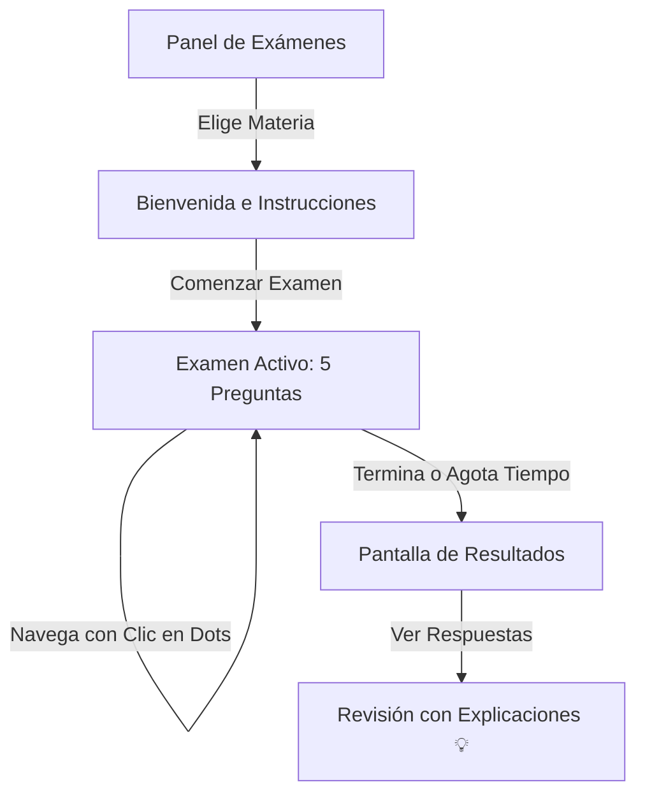

# 🎓 Presentación y Guía del Sistema de Exámenes - CertiWebs

Este documento ofrece una explicación estructurada, visual y detallada de la arquitectura, diseño de código y banco de respuestas para el **Sistema de Certificaciones de CertiWebs**.

---

## 1. 🌟 Explicación General del Sistema (Presentación)

El módulo de exámenes de CertiWebs se diseñó para ofrecer evaluaciones web rápidas, modernas y de gran valor educativo.



### Características Clave:
* **Exámenes Rápidos y Dinámicos**: Cada examen consta de **5 preguntas** seleccionadas al azar de un banco de 20. El alumno obtiene una evaluación diferente cada vez.
* **Navegación Libre**: Se implementó una barra de círculos interactivos. El estudiante puede hacer clic en cualquier número para ir directo a esa pregunta sin estar obligado a responder secuencialmente.
* **Temporizador con Alerta**: Un cronómetro en pantalla indica el tiempo disponible. Al restar menos de 60 segundos, el diseño del reloj cambia a rojo brillante y parpadea para denotar urgencia.
* **Retroalimentación Formativa**: Al revisar el examen, cada pregunta incluye una explicación teórica que justifica el porqué de la respuesta correcta.

---

## 2. 💻 Explicación del Código (Arquitectura Técnica)

Aquí se detallan los bloques de código más representativos y su funcionamiento interno:

### A. Selección Aleatoria de Preguntas
Para que cada intento sea un reto distinto, se realiza un barajado de las preguntas usando una comparación al azar y se seleccionan las primeras 5:
```javascript
const limit = examData.preguntas || 5;
const shuffledPool = [...questionPool].sort(() => 0.5 - Math.random());
const questions = shuffledPool.slice(0, limit);
```

### B. Navegación Interactiva por Puntos (Progress Dots)
La barra de progreso genera elementos HTML interactivos. Al pulsar un círculo, se actualiza el estado de la pregunta activa:
```javascript
progressEl.innerHTML = questions.map((_, index) => {
    let stateClass = '';
    if (index < currentQuestion) stateClass = 'completed'; // Respondida
    if (index === currentQuestion) stateClass = 'active';    // Pregunta actual
    
    return `<div class="progress-dot ${stateClass}" onclick="goToQuestion(${index})">${index + 1}</div>`;
}).join('');
```

### C. Alerta Visual del Temporizador
Cuando quedan 60 segundos o menos, el código añade dinámicamente la clase CSS `.warning`, que aplica estilos neón rojos y una animación intermitente:
```javascript
if (timeLeft <= 60) {
    timerEl.classList.add('warning'); // Inicia efecto CSS de alerta
}
```

---

## 3. 📝 Guía Completa de Preguntas y Respuestas

A continuación se listan las **100 preguntas** organizadas de manera limpia y legible para facilitar su estudio o auditoría.

---

### 🌐 HTML Básico

#### Pregunta 1: ¿Qué significa HTML?
* [x] **A)** HyperText Markup Language
* [ ] **B)** Home Tool Markup Language
* [ ] **C)** Hyperlinks and Text Markup Language
* **Explicación**: Es el estándar de estructura para la web (Lenguaje de Marcado de Hipertexto).

#### Pregunta 2: ¿Etiqueta para salto de línea en HTML?
* [x] **A)** `<br>`
* [ ] **B)** `<lb>`
* [ ] **C)** `<break>`
* **Explicación**: Genera un salto de línea simple sin iniciar un nuevo párrafo.

#### Pregunta 3: ¿Qué atributo especifica un enlace?
* [ ] **A)** `src`
* [x] **B)** `href`
* [ ] **C)** `link`
* **Explicación**: El atributo `href` (Hypertext Reference) indica la URL de destino de un enlace.

#### Pregunta 4: ¿Qué etiqueta engloba todo el documento HTML?
* [ ] **A)** `<main>`
* [ ] **B)** `<body>`
* [x] **C)** `<html>`
* **Explicación**: Es la etiqueta raíz que contiene todo el árbol del documento.

#### Pregunta 5: ¿Qué extensión tiene un archivo HTML?
* [ ] **A)** `.htm`
* [ ] **B)** `.html`
* [x] **C)** Ambas
* **Explicación**: Ambas extensiones son procesadas de igual forma por cualquier navegador.

#### Pregunta 6: ¿Etiqueta para crear lista desordenada?
* [x] **A)** `<ul>`
* [ ] **B)** `<ol>`
* [ ] **C)** `<li>`
* **Explicación**: `<ul>` define una lista con viñetas; `<ol>` define una numerada.

#### Pregunta 7: ¿Propósito de "alt" en etiqueta ``?
* [x] **A)** Describir la imagen para accesibilidad
* [ ] **B)** Definir el tamaño de la imagen
* [ ] **C)** Enlazar a otra página
* **Explicación**: Proporciona un texto alternativo si la imagen no se carga o para lectores de pantalla.

#### Pregunta 8: ¿Etiqueta HTML5 para contenido autónomo?
* [x] **A)** `<article>`
* [ ] **B)** `<section>`
* [ ] **C)** `<div>`
* **Explicación**: Representa un bloque independiente y reutilizable (ej. un post).

#### Pregunta 9: ¿Cuál es un elemento en línea (inline)?
* [x] **A)** `<span>`
* [ ] **B)** `<div>`
* [ ] **C)** `<p>`
* **Explicación**: `<span>` no inicia una nueva línea en el documento.

#### Pregunta 10: ¿Etiqueta para el título en la pestaña?
* [x] **A)** `<title>`
* [ ] **B)** `<header>`
* [ ] **C)** `<h1>`
* **Explicación**: Establece el título visible en la pestaña o barra del navegador.

#### Pregunta 11: ¿Etiqueta para insertar JavaScript?
* [ ] **A)** `<javascript>`
* [x] **B)** `<script>`
* [ ] **C)** `<code>`
* **Explicación**: Permite incrustar código JS directamente o enlazar archivos externos.

#### Pregunta 12: ¿Valor por defecto de "target" en `<a>`?
* [ ] **A)** `_blank`
* [x] **B)** `_self`
* [ ] **C)** `_parent`
* **Explicación**: Abre el enlace en el mismo marco de navegación actual.

#### Pregunta 13: ¿Etiqueta HTML5 para encabezados?
* [ ] **A)** `<head>`
* [x] **B)** `<header>`
* [ ] **C)** `<heading>`
* **Explicación**: Contenedor para la cabecera del sitio o de una sección.

#### Pregunta 14: ¿Atributo para campo obligatorio?
* [x] **A)** `required`
* [ ] **B)** `validate`
* [ ] **C)** `mandatory`
* **Explicación**: Evita que se envíe un formulario si el campo está vacío.

#### Pregunta 15: ¿Etiqueta para reproducir audio?
* [ ] **A)** `<sound>`
* [x] **B)** `<audio>`
* [ ] **C)** `<media>`
* **Explicación**: Permite incrustar reproductores de audio nativos.

#### Pregunta 16: ¿Etiqueta HTML5 para barra lateral?
* [x] **A)** `<aside>`
* [ ] **B)** `<sidebar>`
* [ ] **C)** `<section>`
* **Explicación**: Define contenido secundario o marginal de la página.

#### Pregunta 17: ¿Qué hace `<meta charset="UTF-8">`?
* [ ] **A)** Especificar el idioma de la página
* [x] **B)** Especificar la codificación de caracteres
* [ ] **C)** Mejorar el posicionamiento SEO
* **Explicación**: Asegura que se muestren tildes y caracteres especiales correctamente.

#### Pregunta 18: ¿Etiqueta HTML5 para agrupar imagen y pie?
* [x] **A)** `<figure>`
* [ ] **B)** `<image-group>`
* [ ] **C)** `<picture>`
* **Explicación**: Agrupa visuales junto con sus descripciones mediante `<figcaption>`.

#### Pregunta 19: ¿Atributo para carga diferida (lazy)?
* [x] **A)** `loading="lazy"`
* [ ] **B)** `lazy="true"`
* [ ] **C)** `defer="image"`
* **Explicación**: Retrasa la descarga de imágenes fuera de pantalla para acelerar la carga de la página.

#### Pregunta 20: ¿Etiqueta para resaltar texto?
* [ ] **A)** `<highlight>`
* [x] **B)** `<mark>`
* [ ] **C)** `<strong>`
* **Explicación**: Aplica un fondo de color (generalmente amarillo) para resaltar texto de referencia.

---

### 🎨 CSS Básico

#### Pregunta 1: ¿Qué significa CSS?
* [x] **A)** Cascading Style Sheets
* [ ] **B)** Creative Style System
* [ ] **C)** Computer Style Syntax
* **Explicación**: Hojas de Estilo en Cascada para aplicar diseño a la web.

#### Pregunta 2: ¿Cómo se selecciona una clase?
* [ ] **A)** `#clase`
* [x] **B)** `.clase`
* [ ] **C)** `clase`
* **Explicación**: El punto indica un selector de clase en CSS.

#### Pregunta 3: ¿Propiedad para color de fondo?
* [x] **A)** `background-color`
* [ ] **B)** `color`
* [ ] **C)** `bgcolor`
* **Explicación**: Define el color de fondo para la caja del elemento.

#### Pregunta 4: ¿Qué unidad es relativa a la fuente?
* [ ] **A)** `px`
* [x] **B)** `em`
* [ ] **C)** `%`
* **Explicación**: `em` equivale al tamaño de fuente actual del elemento o padre.

#### Pregunta 5: ¿Cómo se comenta en CSS?
* [x] **A)** `/* comentario */`
* [ ] **B)** `// comentario`
* [ ] **C)** `<!-- comentario -->`
* **Explicación**: Los comentarios en CSS solo se delimitan entre `/*` y `*/`.

#### Pregunta 6: ¿Propiedad para espaciado interno?
* [x] **A)** `padding`
* [ ] **B)** `margin`
* [ ] **C)** `border-spacing`
* **Explicación**: Crea espacio entre el borde y el contenido del elemento.

#### Pregunta 7: ¿Selector para elemento con ID "header"?
* [x] **A)** `#header`
* [ ] **B)** `.header`
* [ ] **C)** `header`
* **Explicación**: El carácter `#` se usa para apuntar a un ID único.

#### Pregunta 8: ¿Propiedad para cambiar tipografía?
* [x] **A)** `font-family`
* [ ] **B)** `font-style`
* [ ] **C)** `font-type`
* **Explicación**: Especifica las fuentes para dar formato al texto.

#### Pregunta 9: ¿Position para fijar a la ventana?
* [x] **A)** `fixed`
* [ ] **B)** `absolute`
* [ ] **C)** `sticky`
* **Explicación**: Mantiene al elemento fijo en la ventana del navegador al hacer scroll.

#### Pregunta 10: ¿Cómo quitar subrayado a enlaces?
* [x] **A)** `text-decoration: none;`
* [ ] **B)** `text-style: no-underline;`
* [ ] **C)** `link-style: none;`
* **Explicación**: Remueve el decorado de línea por defecto de las etiquetas `<a>`.

#### Pregunta 11: ¿Propiedad para contenido desbordado?
* [x] **A)** `overflow`
* [ ] **B)** `clip`
* [ ] **C)** `display`
* **Explicación**: Controla qué sucede si el contenido excede las dimensiones de la caja.

#### Pregunta 12: ¿Diferencia: display:none y visibility:hidden?
* [x] **A)** `display: none` elimina el espacio; `visibility: hidden` lo conserva
* [ ] **B)** `visibility: hidden` elimina el espacio; `display: none` lo conserva
* [ ] **C)** No hay diferencias
* **Explicación**: `display: none` remueve el elemento del flujo visual; `visibility` solo lo hace invisible.

#### Pregunta 13: ¿Selector para elementos hijos pares?
* [x] **A)** `:nth-child(even)`
* [ ] **B)** `:nth-child(odd)`
* [ ] **C)** `:nth-child(2)`
* **Explicación**: Selecciona los elementos hermanos en posiciones pares.

#### Pregunta 14: ¿Propiedad para orden tridimensional (eje Z)?
* [x] **A)** `z-index`
* [ ] **B)** `layer-index`
* [ ] **C)** `3d-position`
* **Explicación**: Controla el nivel de superposición de los elementos posicionados.

#### Pregunta 15: ¿Propiedad para sombras en contenedor?
* [ ] **A)** `text-shadow`
* [x] **B)** `box-shadow`
* [ ] **C)** `shadow-color`
* **Explicación**: Aplica sombras a los bordes exteriores de la caja de un elemento.

#### Pregunta 16: ¿Cómo se declara una variable CSS?
* [ ] **A)** `var-mi-variable: valor;`
* [x] **B)** `--mi-variable: valor;`
* [ ] **C)** `$mi-variable: valor;`
* **Explicación**: Las variables nativas de CSS siempre comienzan con doble guion.

#### Pregunta 17: ¿Flexbox: alinear en eje secundario?
* [ ] **A)** `justify-content`
* [x] **B)** `align-items`
* [ ] **C)** `flex-direction`
* **Explicación**: Alinea los elementos dentro del eje perpendicular (cross axis) de Flexbox.

#### Pregunta 18: ¿Propiedad para fondo fijo/móvil?
* [x] **A)** `background-attachment`
* [ ] **B)** `background-scroll`
* [ ] **C)** `background-fixed`
* **Explicación**: Si se define como `fixed`, la imagen no se moverá al deslizar la página.

#### Pregunta 19: ¿Valor por defecto de "position"?
* [ ] **A)** `relative`
* [x] **B)** `static`
* [ ] **C)** `absolute`
* **Explicación**: Indica que el elemento sigue el orden normal en el flujo del documento.

#### Pregunta 20: ¿Cómo aplicar desenfoque (blur)?
* [x] **A)** `filter: blur(5px);`
* [ ] **B)** `backdrop-filter: blur(5px);`
* [ ] **C)** `image-effect: blur(5px);`
* **Explicación**: Permite aplicar desenfoque directo al contenido de la caja.

---

### ⚡ JavaScript Básico

#### Pregunta 1: ¿Qué tipo de lenguaje es JavaScript?
* [ ] **A)** Compilado
* [x] **B)** Interpretado
* [ ] **C)** Ambos
* **Explicación**: Se procesa e interpreta en tiempo de ejecución por el motor de JS del cliente.

#### Pregunta 2: ¿Cómo declarar variable en JavaScript?
* [x] **A)** `var x;`
* [ ] **B)** `int x;`
* [ ] **C)** `let x = 0;`
* **Explicación**: `var`, `let` y `const` son las palabras reservadas para declarar variables en JS.

#### Pregunta 3: ¿Método para mostrar alerta en pantalla?
* [x] **A)** `alert()`
* [ ] **B)** `print()`
* [ ] **C)** `show()`
* **Explicación**: Abre una alerta modal informativa nativa del navegador.

#### Pregunta 4: ¿Cuál NO es un tipo de dato en JS?
* [ ] **A)** `string`
* [x] **B)** `float`
* [ ] **C)** `boolean`
* **Explicación**: En JavaScript no hay tipo flotante exclusivo; todos los números son del tipo `number`.

#### Pregunta 5: ¿Comentario de una línea en JS?
* [x] **A)** `// comentario`
* [ ] **B)** `/* comentario */`
* [ ] **C)** `<!-- comentario -->`
* **Explicación**: El doble guion diagonal le indica al intérprete ignorar el resto de la línea.

#### Pregunta 6: ¿Método para convertir texto a entero?
* [x] **A)** `parseInt()`
* [ ] **B)** `toString()`
* [ ] **C)** `parseNumber()`
* **Explicación**: Parsea un string para devolver un número entero.

#### Pregunta 7: ¿Operador de igualdad estricta?
* [x] **A)** `===`
* [ ] **B)** `==`
* [ ] **C)** `=`
* **Explicación**: Evalúa la igualdad tanto de valor como del tipo de dato.

#### Pregunta 8: ¿Cómo agregar elemento al final de array?
* [x] **A)** `array.push()`
* [ ] **B)** `array.pop()`
* [ ] **C)** `array.add()`
* **Explicación**: `push` añade elementos al final; `pop` elimina el último elemento.

#### Pregunta 9: ¿Palabra clave para constantes?
* [x] **A)** `const`
* [ ] **B)** `let`
* [ ] **C)** `var`
* **Explicación**: Declara una variable de bloque cuyo valor referencial no puede cambiar.

#### Pregunta 10: ¿Evento disparado al hacer clic?
* [x] **A)** `onclick`
* [ ] **B)** `onhover`
* [ ] **C)** `onsubmit`
* **Explicación**: Detecta la pulsación física del mouse sobre un elemento.

#### Pregunta 11: ¿Diferencia entre == y ===?
* [x] **A)** `==` convierte tipos; `===` compara valor y tipo sin convertir
* [ ] **B)** `==` es asignación; `===` es comparación
* [ ] **C)** No hay diferencias
* **Explicación**: `==` realiza coerción de tipos; `===` requiere tipos de datos idénticos.

#### Pregunta 12: ¿Qué es un "closure" en JS?
* [x] **A)** Función que recuerda variables de su ámbito externo
* [ ] **B)** Función que se ejecuta de inmediato
* [ ] **C)** Ámbito exclusivo global
* **Explicación**: Permite a una función acceder al ámbito de su función contenedora incluso después de que esta haya finalizado.

#### Pregunta 13: ¿Resultado de typeof null?
* [x] **A)** `"object"`
* [ ] **B)** `"null"`
* [ ] **C)** `"undefined"`
* **Explicación**: Es una falla de diseño histórica en JS que se mantiene por compatibilidad.

#### Pregunta 14: ¿Método para mapear y transformar array?
* [x] **A)** `map()`
* [ ] **B)** `forEach()`
* [ ] **C)** `filter()`
* **Explicación**: Genera un nuevo array aplicando una función de transformación a cada celda.

#### Pregunta 15: ¿Qué significa que JS es monohilo?
* [x] **A)** Ejecuta una sola tarea a la vez en un solo hilo
* [ ] **B)** Tiene múltiples hilos paralelos
* [ ] **C)** Funciona en un solo procesador
* **Explicación**: Utiliza un solo hilo principal (single-thread) para procesar su cola de llamadas.

#### Pregunta 16: ¿Capturar error asíncrono con try...catch?
* [x] **A)** Usar `await` y estar dentro del bloque `try`
* [ ] **B)** Usando `.then().catch()`
* [ ] **C)** Poner `try` en el callback
* **Explicación**: Para que un bloque `try...catch` atrape el error de una promesa, esta debe esperar su resolución con `await`.

#### Pregunta 17: ¿Qué hace el método reduce?
* [x] **A)** Aplica una función acumuladora para obtener un único valor
* [ ] **B)** Elimina elementos duplicados
* [ ] **C)** Reduce el tamaño del array
* **Explicación**: Procesa secuencialmente los elementos de un array para consolidarlos en un único resultado.

#### Pregunta 18: ¿Qué es una Promesa "pending"?
* [x] **A)** Operación asíncrona no completada ni rechazada aún
* [ ] **B)** Promesa resuelta con éxito
* [ ] **C)** Promesa con error de red
* **Explicación**: Indica que la tarea asíncrona asociada sigue en curso.

#### Pregunta 19: ¿Método para unir arrays?
* [x] **A)** `concat()`
* [ ] **B)** `join()`
* [ ] **C)** `merge()`
* **Explicación**: Combina dos o más arreglos devolviendo un nuevo arreglo resultante.

#### Pregunta 20: ¿Clases: palabra para heredar de otra?
* [x] **A)** `extends`
* [ ] **B)** `inherits`
* [ ] **C)** `implements`
* **Explicación**: Se utiliza para implementar herencia clásica de prototipos en ES6.

---

### 📡 Redes y Protocolos

#### Pregunta 1: ¿Qué es una dirección IP?
* [x] **A)** Identificador lógico de red
* [ ] **B)** Protocolo de enrutamiento
* [ ] **C)** Hardware de conexión
* **Explicación**: Etiqueta numérica lógica que ubica a una interfaz del dispositivo en una red.

#### Pregunta 2: ¿Qué puerto por defecto usa HTTP?
* [ ] **A)** `21`
* [x] **B)** `80`
* [ ] **C)** `443`
* **Explicación**: Puerto 80 es la vía de comunicación no segura (HTTP); HTTPS utiliza el 443.

#### Pregunta 3: ¿Qué significa LAN?
* [ ] **A)** Large Area Network
* [x] **B)** Local Area Network
* [ ] **C)** Light Area Network
* **Explicación**: Local Area Network (Red de Área Local), confinada a distancias cortas.

#### Pregunta 4: ¿Qué dispositivo conecta redes distintas?
* [ ] **A)** Switch
* [x] **B)** Router
* [ ] **C)** Hub
* **Explicación**: El enrutador rutea paquetes entre redes lógicamente independientes.

#### Pregunta 5: ¿Qué protocolo asigna IPs automáticamente?
* [ ] **A)** DNS
* [x] **B)** DHCP
* [ ] **C)** FTP
* **Explicación**: DHCP (Dynamic Host Configuration Protocol) configura IPs de forma automática.

#### Pregunta 6: ¿Protocolo seguro para páginas web?
* [x] **A)** HTTPS
* [ ] **B)** HTTP
* [ ] **C)** FTP
* **Explicación**: Es la versión de HTTP con cifrado de capa de transporte SSL/TLS.

#### Pregunta 7: ¿Qué significa DNS?
* [x] **A)** Domain Name System
* [ ] **B)** Digital Network Service
* [ ] **C)** Dynamic Name Server
* **Explicación**: Traduce nombres legibles de dominio a direcciones IP físicas.

#### Pregunta 8: ¿Máscara por defecto de Clase C?
* [x] **A)** `255.255.255.0`
* [ ] **B)** `255.255.0.0`
* [ ] **C)** `255.0.0.0`
* **Explicación**: Corresponde a una máscara de red con prefijo `/24` (24 bits para red, 8 para hosts).

#### Pregunta 9: ¿Qué capa OSI enruta paquetes?
* [x] **A)** Capa de Red
* [ ] **B)** Capa Física
* [ ] **C)** Capa de Transporte
* **Explicación**: Capa 3 (Red) del modelo OSI, responsable del direccionamiento e IP.

#### Pregunta 10: ¿Puerto estándar de SMTP seguro?
* [x] **A)** `465`
* [ ] **B)** `80`
* [ ] **C)** `22`
* **Explicación**: El puerto 465 se destina para conexiones SMTP encriptadas mediante SSL/TLS.

#### Pregunta 11: ¿Propósito del protocolo ARP?
* [x] **A)** Traducir direcciones IP a direcciones físicas MAC
* [ ] **B)** Asignar IPs fijas
* [ ] **C)** Garantizar envío fiable
* **Explicación**: Resuelve y asocia direcciones IP de capa 3 con direcciones MAC de capa 2.

#### Pregunta 12: ¿Capa TCP/IP donde opera HTTP?
* [x] **A)** Capa de Aplicación
* [ ] **B)** Capa de Internet
* [ ] **C)** Capa de Acceso a Red
* **Explicación**: Los navegadores y servidores web interactúan en la capa superior de Aplicación.

#### Pregunta 13: ¿Rango IP privado de Clase C?
* [x] **A)** `192.168.0.0` a `192.168.255.255`
* [ ] **B)** `10.0.0.0` a `10.255.255.255`
* [ ] **C)** `172.16.0.0` a `172.31.255.255`
* **Explicación**: El bloque privado local reservado para redes domésticas o pequeñas oficinas.

#### Pregunta 14: ¿Protocolo de transporte con conexión?
* [ ] **A)** UDP
* [x] **B)** TCP
* [ ] **C)** IP
* **Explicación**: TCP garantiza entrega secuencial y control de flujo mediante un saludo inicial.

#### Pregunta 15: ¿Qué hace NAT en un router?
* [x] **A)** Traduce direcciones IP privadas a una pública para compartir internet
* [ ] **B)** Controla flujo de paquetes
* [ ] **C)** Cifra datos en tránsito
* **Explicación**: Permite navegar externamente compartiendo la misma dirección IP pública provista por el proveedor de servicios.

#### Pregunta 16: ¿Puerto por defecto de SSH/SFTP?
* [x] **A)** `22`
* [ ] **B)** `21`
* [ ] **C)** `80`
* **Explicación**: El puerto estándar de consola y transferencia de archivos seguras bajo protocolo SSH.

#### Pregunta 17: ¿Función principal de un Proxy?
* [x] **A)** Actuar como intermediario entre un cliente y el servidor
* [ ] **B)** Asignar IPs en una red
* [ ] **C)** Acelerar la CPU de los routers
* **Explicación**: Intercepta peticiones para control de accesos, almacenamiento en caché o seguridad de red.

#### Pregunta 18: ¿Qué representa la dirección ::1?
* [x] **A)** La dirección de loopback local en IPv6
* [ ] **B)** Dirección IP pública reservada
* [ ] **C)** Equivalente a 255.255.255.255
* **Explicación**: Apunta a la propia máquina actual (localhost) en redes configuradas con IPv6.

#### Pregunta 19: ¿Protocolo para evitar bucles en switches?
* [x] **A)** STP (Spanning Tree Protocol)
* [ ] **B)** RIP (Routing Information Protocol)
* [ ] **C)** OSPF
* **Explicación**: STP bloquea de forma lógica puertos duplicados para evitar tormentas de datos.

#### Pregunta 20: ¿Propósito principal del protocolo ICMP?
* [x] **A)** Enviar mensajes de control y reporte de errores (como ping)
* [ ] **B)** Transferir archivos
* [ ] **C)** Configurar switches
* **Explicación**: Proporciona diagnósticos sobre la alcanzabilidad del host.

---

### 💻 Sistemas Operativos

#### Pregunta 1: ¿Qué es un sistema operativo?
* [ ] **A)** Programa de aplicación
* [x] **B)** Software que administra hardware y recursos
* [ ] **C)** Hardware del procesador
* **Explicación**: Administra los recursos físicos e interactúa directamente con los componentes de la máquina.

#### Pregunta 2: ¿Cuál NO es un sistema operativo?
* [ ] **A)** Linux
* [ ] **B)** Windows
* [x] **C)** HTML
* **Explicación**: HTML es un lenguaje de marcado hipertexto; no es software de sistema.

#### Pregunta 3: ¿Comando Linux para listar archivos?
* [x] **A)** `ls`
* [ ] **B)** `cd`
* [ ] **C)** `pwd`
* **Explicación**: Lista los ficheros y directorios visibles en la ubicación de consola actual.

#### Pregunta 4: ¿Qué es un proceso en el SO?
* [x] **A)** Un programa en estado de ejecución activa
* [ ] **B)** Un archivo estático en disco
* [ ] **C)** Usuario de red
* **Explicación**: Es la abstracción de una aplicación en uso cargada en la memoria volátil del procesador.

#### Pregunta 5: ¿SO de código abierto?
* [ ] **A)** Windows
* [x] **B)** Linux
* [ ] **C)** macOS
* **Explicación**: Su núcleo (kernel) está distribuido públicamente bajo licencias libres.

#### Pregunta 6: ¿Comando Linux para cambiar permisos?
* [x] **A)** `chmod`
* [ ] **B)** `chown`
* [ ] **C)** `chperm`
* **Explicación**: Cambia los permisos de lectura, escritura o ejecución de un elemento.

#### Pregunta 7: ¿Sistema de archivos estándar Windows?
* [x] **A)** NTFS
* [ ] **B)** ext4
* [ ] **C)** FAT32
* **Explicación**: NTFS es la tecnología nativa moderna en sistemas Windows 10/11.

#### Pregunta 8: ¿Qué es la memoria virtual (swap)?
* [x] **A)** Espacio en disco utilizado para extender la memoria RAM
* [ ] **B)** Chip de memoria ultra rápida
* [ ] **C)** Memoria volátil en la nube
* **Explicación**: Swap utiliza almacenamiento secundario en disco como caché de auxilio si la memoria RAM se satura.

#### Pregunta 9: ¿Comando Linux para ruta actual?
* [x] **A)** `pwd`
* [ ] **B)** `cd`
* [ ] **C)** `whereami`
* **Explicación**: `pwd` (print working directory) imprime en pantalla el directorio de consola activo.

#### Pregunta 10: ¿Estructura para cola de procesos?
* [x] **A)** Cola de procesos
* [ ] **B)** Pila de llamadas
* [ ] **C)** Árbol de directorios
* **Explicación**: Estructura de fila secuencial FIFO donde los procesos aguardan por recursos del CPU.

#### Pregunta 11: ¿Qué es un Deadlock (interbloqueo)?
* [x] **A)** Procesos bloqueados esperando recursos mutuamente de forma indefinida
* [ ] **B)** Fallo del disco duro principal
* [ ] **C)** Virus de memoria RAM
* **Explicación**: Condición de paro donde ningún proceso puede avanzar por dependencia de recursos mutua.

#### Pregunta 12: ¿Comando Linux para buscar texto?
* [x] **A)** `grep`
* [ ] **B)** `find`
* [ ] **C)** `search`
* **Explicación**: Herramienta de expresiones regulares para buscar patrones en el contenido de archivos.

#### Pregunta 13: ¿Qué hace la tabla de páginas?
* [x] **A)** Mapear direcciones virtuales de procesos a direcciones físicas RAM
* [ ] **B)** Hacer un índice de archivos
* [ ] **C)** Listar usuarios autorizados
* **Explicación**: Traduce las direcciones virtuales referenciadas por el software a la RAM física real.

#### Pregunta 14: ¿Comando Linux para ver procesos en vivo?
* [x] **A)** `top`
* [ ] **B)** `ps`
* [ ] **C)** `process-list`
* **Explicación**: Despliega en vivo el consumo de CPU y memoria de todos los procesos del terminal.

#### Pregunta 15: ¿Qué componente planifica la CPU?
* [x] **A)** Planificador o Scheduler
* [ ] **B)** Gestor de memoria
* [ ] **C)** BIOS
* **Explicación**: El Scheduler distribuye la asignación de ciclos de CPU de acuerdo a algoritmos específicos.

#### Pregunta 16: ¿Qué es una llamada al sistema (syscall)?
* [x] **A)** Interfaz para solicitar servicios del núcleo del SO
* [ ] **B)** Alerta telefónica de error
* [ ] **C)** Interrupción externa de teclado
* **Explicación**: Método de interacción controlada que permite a los programas comunicarse con el kernel.

#### Pregunta 17: ¿Sistema de archivos nativo de Linux?
* [x] **A)** `ext4`
* [ ] **B)** NTFS
* [ ] **C)** APFS
* **Explicación**: Cuarto sistema de archivos extendido nativo en distribuciones Linux.

#### Pregunta 18: ¿PowerShell: listar servicios?
* [x] **A)** `Get-Service`
* [ ] **B)** `services.msc`
* [ ] **C)** `list-services`
* **Explicación**: Cmdlet de PowerShell que reporta el listado y estado de servicios en Windows.

#### Pregunta 19: ¿Comando Linux para cambiar dueño?
* [x] **A)** `chown`
* [ ] **B)** `chmod`
* [ ] **C)** `owner`
* **Explicación**: `chown` (change owner) modifica la pertenencia de usuario y grupo de archivos.

#### Pregunta 20: ¿Qué es la fragmentación externa?
* [x] **A)** Memoria total libre suficiente pero no contigua para usarse
* [ ] **B)** Desgaste del hardware de la RAM
* [ ] **C)** Datos corruptos por fallos de luz
* **Explicación**: Hay espacio libre de memoria principal suficiente, pero separado en bloques pequeños no contiguos.
